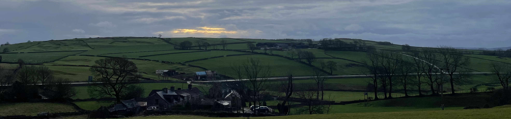

#Welcome to Sparrowpit Methodist Church

We are a friendly and inclusive rural congregation, enjoying traditional services and the well-known methodist hymns (if it's in parts so much the better)

Our regular services are at 2.45pm on the third Sunday of the month.

Upcoming services:

| Date | Leader |
|------|--------|
| 21 Jul | Traditional Hymns service| 
| 18 Aug |  |
| 15 Sep |  |
| 20 Oct |  |
| 17 Nov | Mrs Heather Thomas|

For up to date information on our services and events Like and Follow our [Facebook page](https://www.facebook.com/SparrowpitMethodist)

Read more about the [history](history.md) and [traditions](traditions.md) of Sparrowpit Methodists

